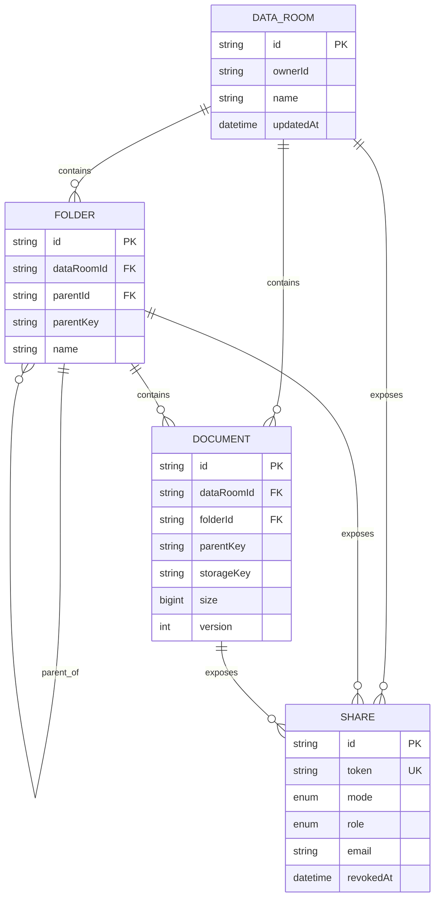

# Vaultroom

Vaultroom is a full-stack data-room MVP for confidential due diligence. Authenticated owners create rooms, organise nested folders, upload and preview PDFs, resolve duplicate names, move or delete documents, and create revocable read-only shares.

## Live architecture

- `apps/web`: Next.js 16, React 19, Clerk, TypeScript
- `apps/api`: NestJS 11, Prisma 7, PostgreSQL, Clerk token verification
- Object storage: S3-compatible bucket (Railway in production)
- Monorepo: pnpm workspaces

The browser talks directly to the Nest API with a short-lived Clerk session token. The API is the sole authority for ownership, hierarchy and share scope. File bytes never enter PostgreSQL: the database stores metadata and an opaque object key, while S3-compatible storage holds the PDF.

## Product scope

- Multiple data rooms per authenticated owner
- Arbitrarily nested folders with breadcrumbs
- Folder create, rename and cascade delete
- Multi-file PDF upload via drag/drop or picker, with per-file progress
- Inline PDF preview
- Conflict-safe naming (`report.pdf`, `report (1).pdf`, ...)
- Document rename, move to any folder/root and delete
- Public or email-restricted, read-only links for a room, folder or individual PDF
- Revocable shares; shared document endpoints re-check scope on every request
- Responsive, keyboard-friendly interface with reduced-motion support

## Entity relationship diagram



`parentKey` deliberately converts a nullable root into the sentinel `root`. PostgreSQL unique constraints can therefore enforce sibling name uniqueness at the room root as well as within folders.

## Local setup

Requirements: Node 22+, pnpm 11, PostgreSQL, an S3-compatible bucket and a Clerk application.

```bash
pnpm install
cp apps/api/.env.example apps/api/.env
cp apps/web/.env.example apps/web/.env.local
pnpm --filter api prisma generate
pnpm --filter api prisma db push
pnpm dev
```

The web app uses `http://localhost:3000`; the API uses `http://localhost:4000`. Populate all values documented in the two example environment files. `AUTH_BYPASS_USER_ID` is a local-only convenience and is ignored when `NODE_ENV=production`.

## Commands

```bash
pnpm typecheck
pnpm test
pnpm build
pnpm --filter api prisma format
pnpm --filter api prisma db push
```

## API summary

Authenticated owner endpoints:

- `GET/POST /rooms`
- `GET /rooms/:roomId/contents?folderId=`
- `POST /rooms/:roomId/folders`
- `PATCH/DELETE /folders/:folderId`
- `POST /rooms/:roomId/documents?folderId=`
- `PATCH/DELETE /documents/:documentId`
- `GET /documents/:documentId/content`
- `POST /shares`, `PATCH /shares/:shareId/revoke`

Viewer endpoints use the unguessable share token and are always read-only:

- `GET /shared/:token`
- `GET /shared/:token/documents/:documentId`

Permissioned links additionally validate the signed-in Clerk user's email against the invitation. A room/folder share does not make arbitrary object keys accessible: the requested document must still be a descendant of the shared target.

## Design decisions and trade-offs

1. **Adjacency list for folders.** It is simple, transactional and easy to mutate. Breadcrumbs walk parents, and destructive deletion uses database cascades after object keys are collected. At very deep or read-heavy scale I would add a materialised path or PostgreSQL `ltree` alongside it.
2. **Object storage outside the database.** This keeps backups and queries small, supports CDN/range delivery later and avoids holding large blobs in database connections.
3. **API-mediated downloads.** The MVP streams through Nest so every read has one obvious authorization boundary. At scale the API would issue short-lived signed URLs after the same authorization check.
4. **Conflict resolution on the server.** Every client gets identical semantics. The composite unique constraints remain the final race-condition guard; production retry logic should catch a unique violation and allocate the next suffix.
5. **Read-only shares only.** The schema has a role for future evolution, but the current API never accepts viewer writes.

## Scaling to millions of files

- Replace offset-style listing with indexed cursor pagination on `(folderId, name, id)`.
- Upload directly to multipart object storage with presigned URLs; finalise metadata asynchronously after checksum and malware scanning.
- Serve PDF ranges through a CDN using short-lived signed URLs.
- Store denormalised aggregate counts and process them with an outbox/queue rather than counting descendants during reads.
- Add `ltree`/materialised paths for one-query subtree checks, while retaining the adjacency relation as the canonical mutation model.
- Partition document and audit-event tables by tenant/room hash, use read replicas for listing and isolate search in OpenSearch.
- Add immutable audit events for view/download/share/revoke, tenant quotas, retention policies and KMS-backed per-tenant encryption keys.
- Make deletion a durable job: mark tombstones transactionally, remove objects idempotently, then purge metadata after retention.

## What I would add next

- Share-management panel listing active links with one-click revocation
- Folder navigation inside a shared room view
- Audit log and download analytics
- Direct multipart uploads, checksums and virus scanning
- Playwright end-to-end tests against disposable Postgres and MinIO
- Optimistic locking for concurrent rename/move operations

## AI usage

AI was used as an implementation partner for initial scaffolding, API/UI drafting and review. Every generated change was inspected, compiled and covered by local type checks/tests. Architecture, security boundaries, data modelling, design direction and trade-offs were decided explicitly for this assignment rather than copied from a generic template.
